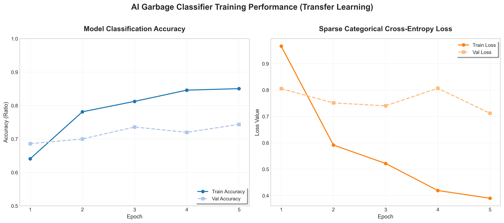

# AI Garbage Classifier

This project implements an AI-based garbage classification system using deep learning techniques. The model is trained to classify different types of garbage into predefined categories, which include cardboard, glass, metal, paper, plastic, and trash. The application is built using Streamlit, providing an interactive web interface for users to train the model and make predictions.

## Project Structure

```
ai-garbage-classifier-streamlit
├── app
│   ├── streamlit_app.py       # Main entry point for the Streamlit web application
│   ├── pages
│   │   ├── Home.py            # Home page of the app
│   │   ├── Train.py           # Page for training the AI model
│   │   └── Predict.py         # Page for making predictions
│   ├── model.py               # Model architecture and loading mechanism
│   └── utils.py               # Utility functions for image preprocessing and data handling
├── notebooks
│   └── train_model.ipynb      # Jupyter notebook for training the AI model
├── data
│   └── garbage_classification   # Directory containing subdirectories for different garbage classes
├── models
│   └── garbage_model.h5       # Saved model after training
├── scripts
│   ├── train.py               # Script for training the model from the command line
│   └── evaluate.py            # Script for evaluating the trained model
├── tests
│   ├── test_model.py          # Unit tests for model functions
│   └── test_app.py            # Tests for the Streamlit app
├── requirements.txt           # List of dependencies required for the project
├── .gitignore                 # Files and directories to be ignored by Git
└── README.md                  # Documentation for the project
```

## Setup Instructions

1. **Clone the Repository**
   ```bash
   git clone <repository-url>
   cd ai-garbage-classifier-streamlit
   ```

2. **Install Dependencies**
   Make sure you have Python installed, then install the required packages:
   ```bash
   pip install -r requirements.txt
   ```

3. **Prepare the Dataset**
   Place your garbage classification images in the `data/garbage_classification` directory, organized into subdirectories for each class.

4. **Train the Model**
   You can train the model using the Jupyter notebook or the command line script:
   - Using Jupyter Notebook:
     ```bash
     jupyter notebook notebooks/train_model.ipynb
     ```
   - Using Command Line:
     ```bash
     python scripts/train.py
     ```

5. **Run the Streamlit App**
   Start the Streamlit application:
   ```bash
   streamlit run app/streamlit_app.py
   ```

## Model Training Performance

The model is built on top of a frozen **MobileNetV2** backbone using transfer learning, with a custom classification head trained on the full dataset of ~2,500 images across 6 classes (*cardboard, glass, metal, paper, plastic, trash*).

### Training Results (5 Epochs)
- **Final Training Accuracy**: `85.03%` (Loss: `0.3896`)
- **Final Validation Accuracy**: `74.35%` (Loss: `0.7116`)

Below are the learning curves generated directly from the training history log (`logs/training_history.csv`):



## Usage

- Navigate to the home page to access different functionalities.
- Use the training page to train the model with your dataset.
- Use the prediction page to upload images and get predictions from the trained model. The prediction page also provides a "Use webcam" option so you can capture a photo with your laptop camera and get a live classification (note: webcam access works when Streamlit runs locally on your machine).
- For continuous real-time streaming predictions, install `streamlit-webrtc` (`pip install streamlit-webrtc`) and enable the "Enable continuous live webcam stream" option on the Predict page.
- You can start training from the Train page; it launches a background training process and writes logs to `logs/training.log` and history to `logs/training_history.csv`.

## Demo model (quick start)

If you want to try the app immediately without training, a small one-epoch demo model is included at `models/demo_garbage_model.h5` (created by `scripts/demo.py`). To use it as the app's default model, copy it over the default path:

```powershell
Copy-Item -Path models\demo_garbage_model.h5 -Destination models\garbage_model.h5 -Force
```

After copying, restart the Streamlit app and try the `Predict` page or webcam capture to see example predictions.

## Contributing

Contributions are welcome! Please feel free to submit a pull request or open an issue for any suggestions or improvements.

## License

This project is licensed under the MIT License. See the LICENSE file for more details.
